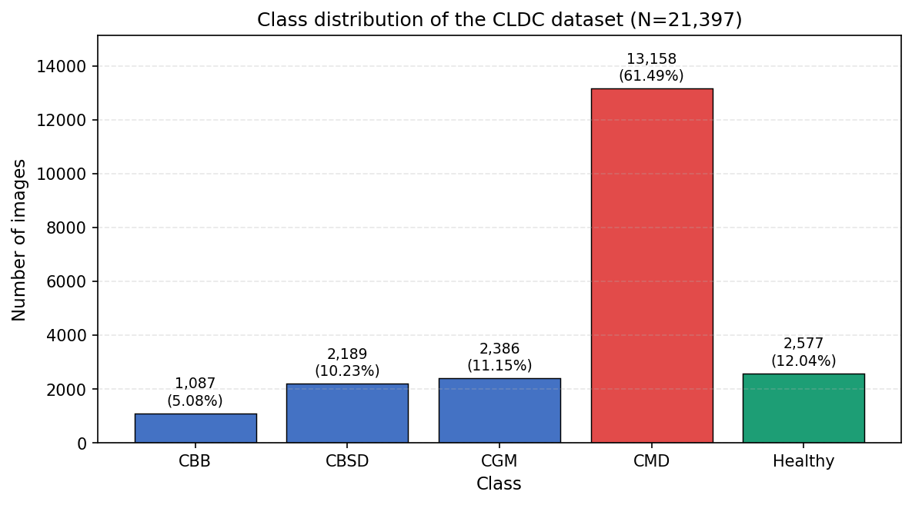
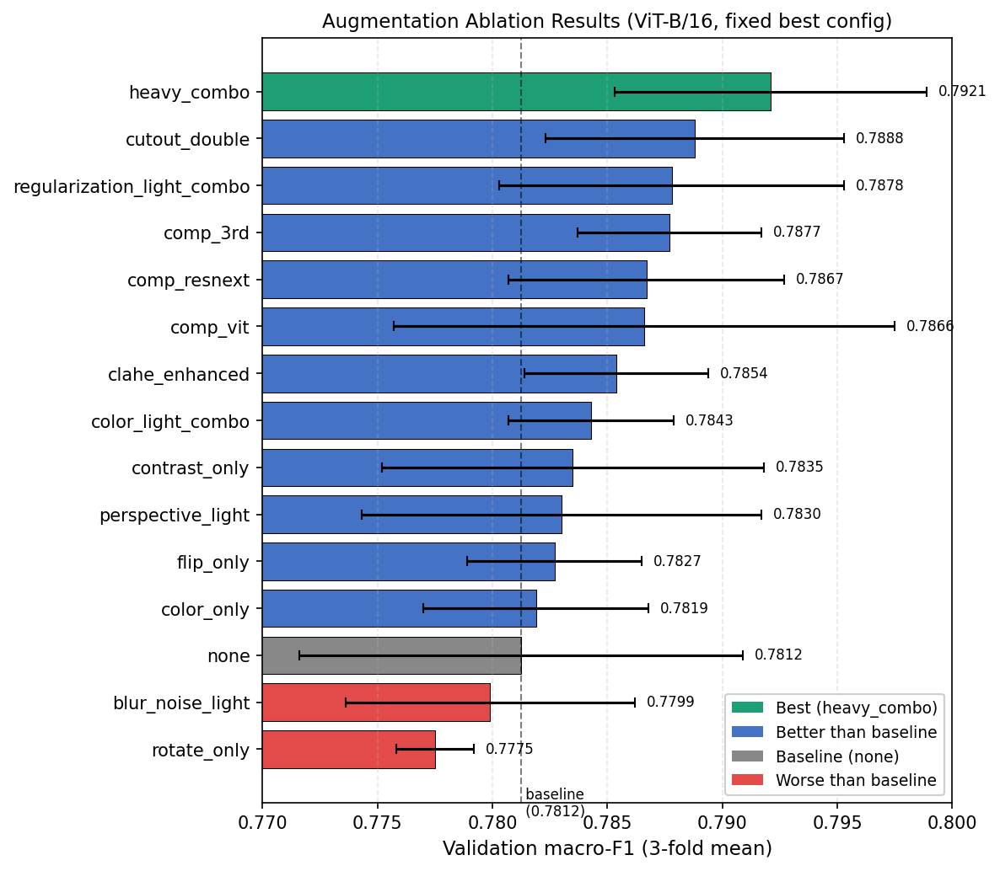
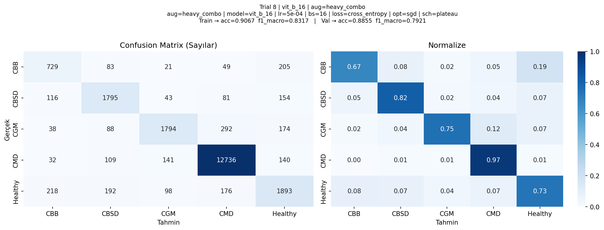

# Cassava Leaf Disease Classification

Two academic computer-vision studies by **Emre Öztürk and Ali Baki Türköz**, who worked jointly and equally at every stage. This private portfolio brings together an undergraduate CNN study (EE470, Yeditepe University) and a later comparative-model study (CS523, Özyeğin University).

## What is the problem?
Given a photograph of a Cassava leaf, predict one of five healthy/disease categories. Field images vary in lighting, clutter, blur and leaf appearance; class imbalance and similar disease patterns make evaluation important. The studies explore image preparation, classification methods, error analysis and the effect of augmentation.

The repository explains **what was done, why the methods were chosen and what the saved outputs show**. It includes selected original code parts, a clearly labelled later code illustration, source-labelled image examples, archived result tables and learning/confusion plots. Full training code, raw datasets and trained model weights are not distributed.

## Two study sections — distinct evaluation settings
| Study | Main approach | Evaluation | Main archived outcome |
|---|---|---|---|
| [EE470](docs/EE470_STUDY.md) | CNN trained from scratch; image preparation and dataset variants | 500 test images later sent by the course instructor | Latest available report `_3`: 55% accuracy, loss 1.6717 |
| [CS523](docs/CS523_STUDY.md) | Classical ML, ResNet-50, EfficientNet-B4 and ViT-B/16; augmentation comparisons | Three-fold stratified validation on approximately 21,397 images | Selected ViT heavy_combo: macro-F1 0.7921±0.0068; accuracy 88.55%±0.40% |

**These scores are not a direct before/after comparison.** Datasets and protocols differ. EE470's presentation has a separate 59.80% test statement; its later available report is used as the main source and the discrepancy is documented. CS523's tuning and augmentation decisions use the same validation folds, so its selected result is a development comparison rather than an untouched final test. No model was retrained to prepare this portfolio.

## What does the image data look like?
Five examples, one per CS523 source label, are included in the [image gallery](docs/IMAGE_EXAMPLES.md). They illustrate the task rather than form a new training dataset. Labels are preserved from the source.

*A representative CBB-labelled field image from the supplied CS523 report materials; backgrounds and lighting vary.*

## Why macro-F1 and augmentation matter

*The majority CMD class makes up 61.49% of the CS523 dataset. Accuracy alone can hide poor minority-class performance.*

*Fifteen saved augmentation comparisons. The selected heavy_combo macro-F1 is 0.7921; the none baseline is 0.7812. The plot has a truncated axis, so use the numerical differences.*

*Archived validation/OOF errors across the CS523 classes. This is not the EE470 instructor test.*

[Complete figure gallery](docs/FIGURE_GALLERY.md) includes baseline and augmentation learning curves, per-class metrics and EE470 presentation model/curve images.

## How the work was carried out
EE470: prepare/inspect images, resize inputs, compare collection variants, define a five-class CNN, train with early stopping, inspect learning curves and evaluate saved predictions on the instructor's test set. The selected original source has five convolution/pooling blocks with dropout and a dense classifier; its declared augmentation object is not inserted in that inspected model definition.

CS523: compare a grayscale-pixel/PCA baseline with pretrained models, use stratified folds, search training settings and class weighting, then examine fixed-configuration augmentation policies. Report macro-F1, accuracy, class metrics and confusion matrices. [Detailed method and scope](docs/CS523_STUDY.md).

## Selected code and evidence
- [Original EE470 architecture excerpt](examples/ee470_architecture_excerpt.py): selected source definitions, without full training or private paths.
- [Illustrative CS523 baseline recipe](examples/cs523_classical_recipe.py): a later educational example, not recovered original training code.
- [Saved result tables](results/README.md): source-backed report values, not results generated by the excerpts.
- [Data and provenance](docs/DATA_AND_PROVENANCE.md) and [source manifest](docs/SOURCE_MANIFEST.json).

The work demonstrates image preprocessing, comparative modelling, transfer learning, dimensionality reduction, class-imbalance analysis, augmentation and evaluation. The repository remains **private**. It documents academic experiments and their limits; a deployed field diagnosis system is outside the delivered scope.
