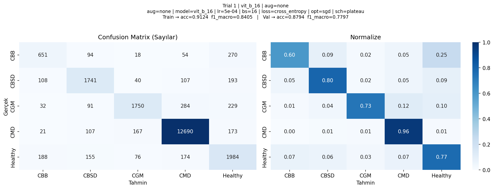
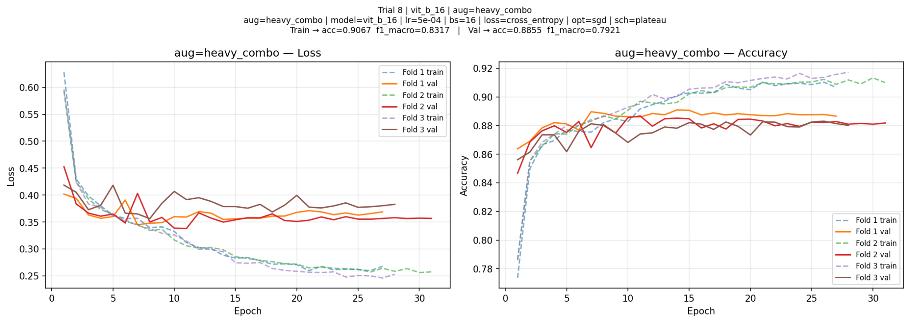
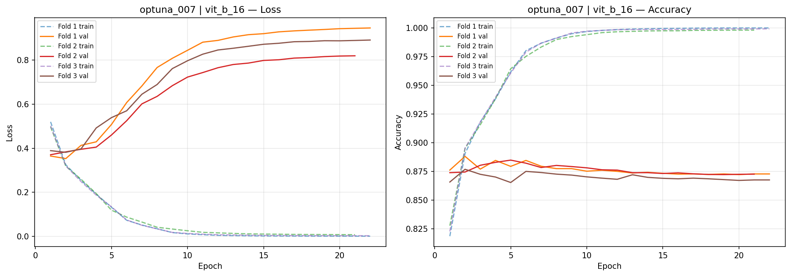
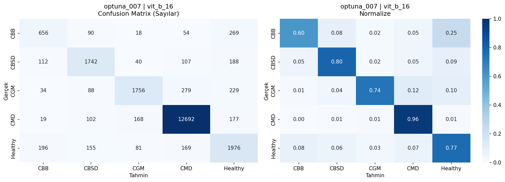
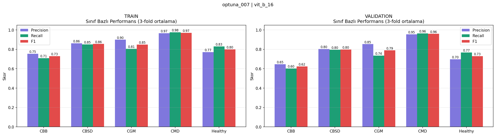
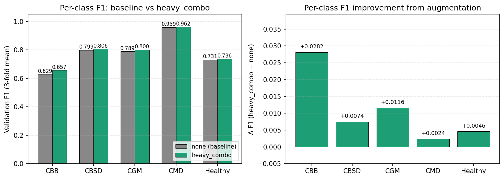
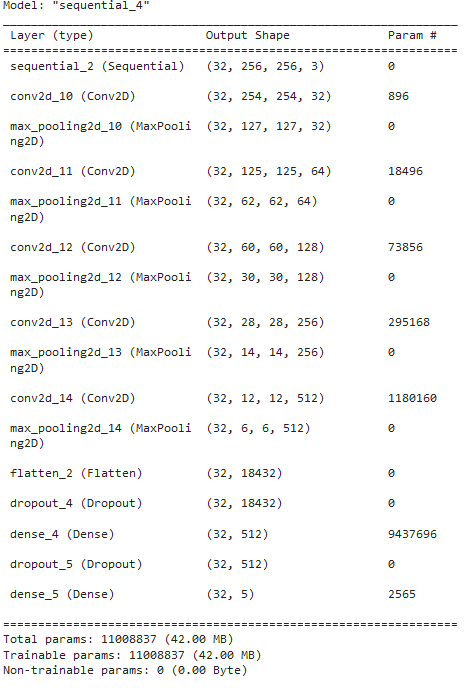
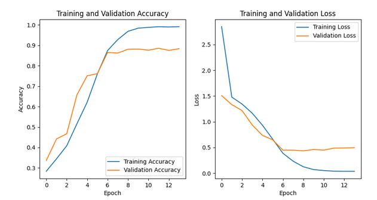
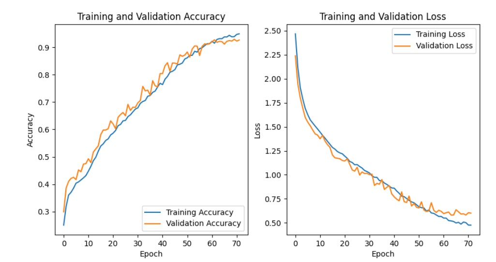

# Saved figures: CS523 and EE470

Images are copied unchanged from supplied project files. They show archived experiments; no model was retrained for this repository. The two studies use different datasets and evaluation protocols.

## CS523: comparative models and augmentation

### Class imbalance

21,397 images, including 13,158 CMD examples. Counts refer to the CS523 benchmark, not EE470.

### Augmentation comparison

Fifteen augmentation policies compared with the selected ViT configuration. The horizontal axis is truncated near 0.77; use the numerical values rather than relative bar lengths to judge the small differences.

### No-augmentation confusion matrix

Archived baseline validation/OOF classification counts and row-normalized values.

### Heavy-combination confusion matrix

Archived selected heavy_combo validation/OOF results. The saved figure reports accuracy 0.8855 and macro-F1 0.7921 in its heading.

### Training with heavy augmentation

Training/validation curves across three folds for the selected heavy_combo trial.

### Pre-augmentation learning curves

Archived selected pre-augmentation trial. The rapid training fit and rising validation loss motivate examining regularization and augmentation.

### Selected pre-augmentation trial

Archived pre-augmentation OOF confusion matrix; distinct from the subsequent augmentation ablation baseline.

### Per-class metrics before augmentation

Training and validation metrics show why minority-class performance matters alongside overall accuracy.

### Per-class augmentation changes

The saved comparison reports the largest F1 gain for the minority CBB class. Values are descriptive results from the selected development comparison.

## EE470: model summary

The presentation model summary shows 11,008,837 parameters.

## EE470: early trial curves

An earlier presentation trial shows a training–validation gap; this is not the instructor test result.

## EE470: adjusted trial curves

The presentation shows a later adjusted trial. Its learning curves are internal training/validation curves, not the separate 500-image instructor test.

