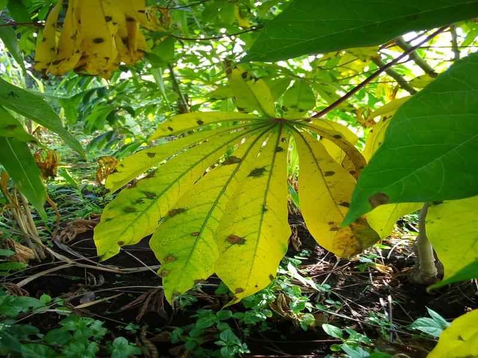
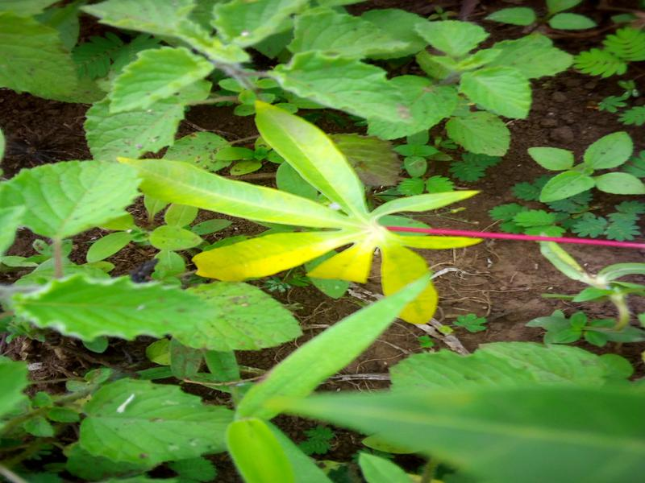
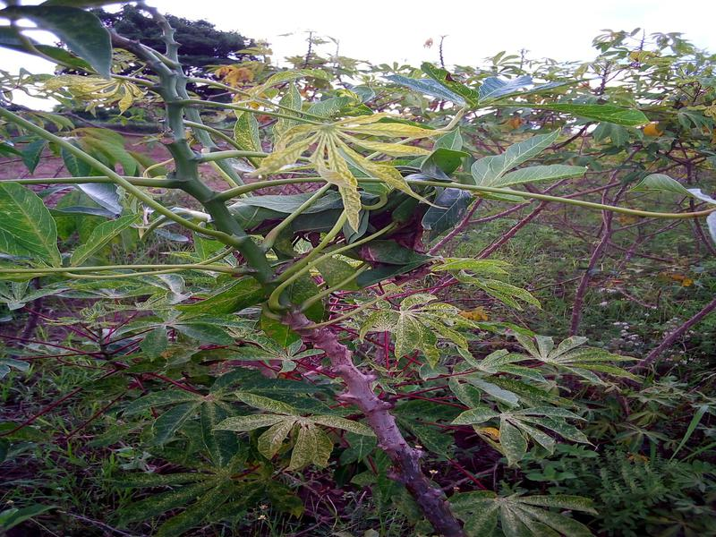
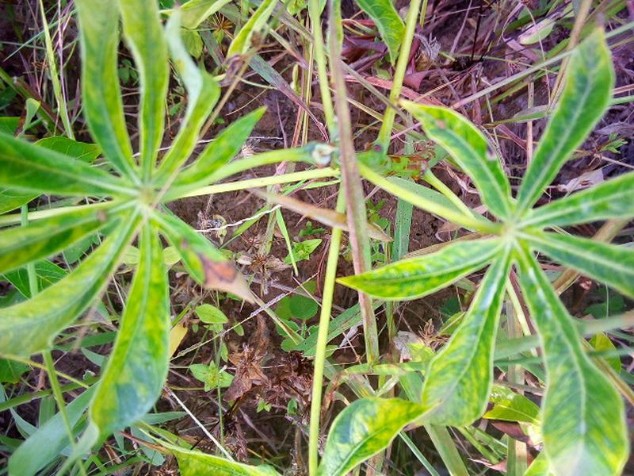
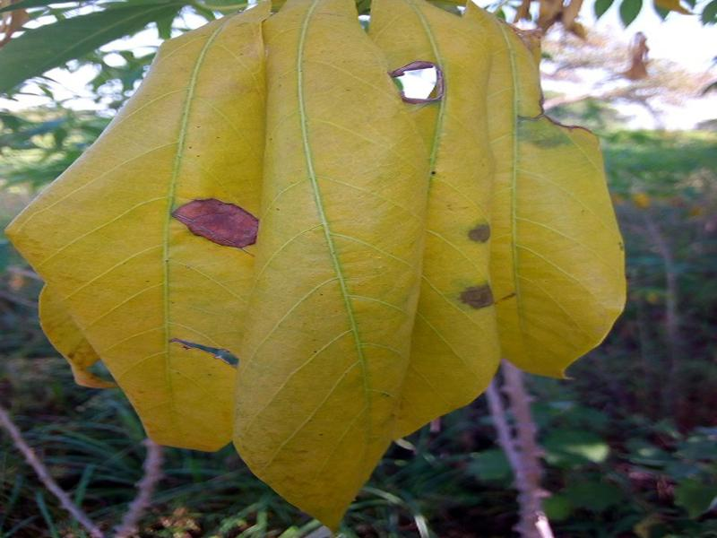

# Representative image examples

One supplied CS523 training image per source label. These are illustrations, not a new training set or the instructor-supplied EE470 test set. Source labels are preserved; they are not independently diagnosed from appearance.

## Cassava Bacterial Blight (CBB)

## Cassava Brown Streak Disease (CBSD)

## Cassava Green Mite (CGM)

## Cassava Mosaic Disease (CMD)

## Healthy

The CS523 source includes duplicate files for label 2 with Green Mite and Green Mottle names. Only the Green Mite-labelled version used by its final paper is included. EE470 uses the Green Mottle wording in its own source; the course-specific terminology is retained. Images belong to the source benchmark, rather than being photographs taken by the project authors.
